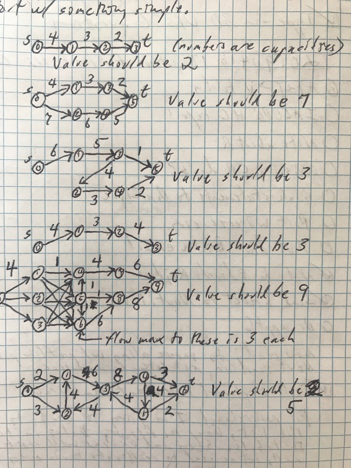

Some of the tests for preflow-push create networks for testing maximum flow.
It's generally nice to have diagrams of these networks.
Putting the diagrams in the test code using ascii art is a bit cumbersome.
This image  has some diagrams.
