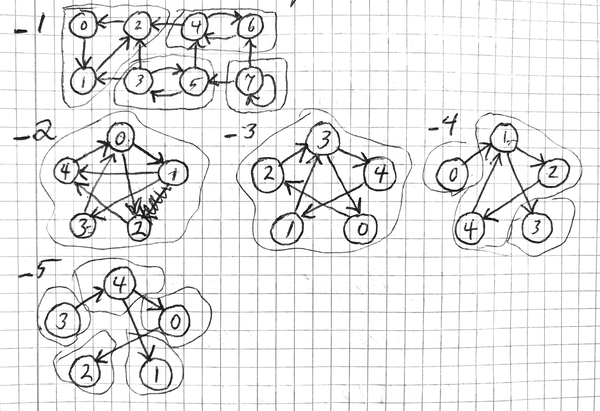

# Testing the Tarjan implementation

The tests for digraph component identification are in tests/test_tarjan.c.
They use the networks diagrammed here.

Network _2 was interesting, because, unlike the test network in the
[Wikipedia article][wikitarjan], it causes the algorithm to encounter
an already visited node in the depth-first search that has a value different
for `lowlink` than for `index`, and that is already on the stack.
That occurs when node 4 is visited from node 2. At that point, node 4
has already been visited from node 1 and placed on the stack.

When encountering a node already visited and already on the stack,
the algorithm, as originally presented in the referenced
article [(1)][tarjan], assigns the `index` value from the visited node to
the `lowlink` value of the visiting node. (It is smaller than the existing
value.)

We found it better to apply the `lowlink` value from the visited node.
Doing so caused all nodes in the component to have the same value for `lowlink`.
If that creates a problem, this was a clue.

[wikitarjan]: https://en.wikipedia.org/wiki/Tarjan%27s_strongly_connected_components_algorithm
[tarjan]: https://epubs.siam.org/doi/10.1137/0201010
