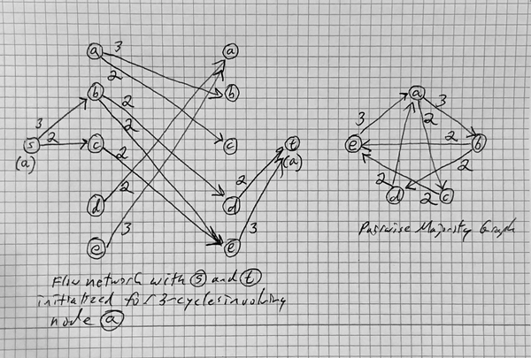

The [Conitzer and Davenport paper][bounds] describes improved lower
bounds computed using maximim flow over a capacity network.

We set-up the network as described in the paper, for each alternative
in any strongly connected component of the majority graph.
The method allows overlapping cycles, but requires removing
the flow found in a cycle through one alternative
before finding flow in a cycle through a subsequent alternative.
Otherwise weight on an overlapping cycle can be counted multiple times.

The flow network we use has structure as follows:
- a source node `s`
- two columns, each with a node for every alternative
- a sink node `t`
- directed capacity edges between the two columns matching those of the pairwise
majority graph. For example, a majority of 3 preferences for A over B causes
an edge of capacity 3 directed from the node representing A in the first
column to the node representing B in the second column.

In the following, we refer to the node in the first column that represents
`a_i` in the pairwise majority graph as `a_i'`. We refer to the node in the
second column as `a_i"`.

For each alterative `a_i`, we initialize capacities and flows from the source
node `s` to the nodes `a_j'` (`j <> i`) as follows:
- capacity of `s` to `a_j'` is as from `a_i` to `a_j` in the majority graph
- flow of `s` to `a_j'` is the current flow accumulated between `a_i'`
and `a_j"`. This is only justified by the after step, described shortly.
- capacity and flow of `s` to `a_i'` are zero
(this would represent an edge to self in the majority graph).

We initialize capacities and flows from the nodes `a_j"` (`j <> i`)
to the sink node `t` as follows:
- capacity of `a_j"` to `t` is as from `a_j` to `a_i` in the majority graph
- flow of `a_j"` to `t` is the current flow accumulated between `a_j'`
and `a_i"`. This is justified by the after step.
- capacity and flow of `a_i"` to `t` are zero.

After running the maximum flow algorithm on this graph, we
- zero all negative flows.
- copy flows from `s` to `a_j'` onto the flows from `a_i'` to `a_j"`.
- copy flows from `a_j"` to `t` onto the flows from `a_j'` to `a_i"`.

In this way, the edges between columns on the flow network are always
up to date with the accumulated flow. There is no need to do capacity
reductions on a copy of the majority graph and reconstruct a capacity
network for each alternative.

This is justified because, for flow with source and sink representing `a_i`:
- The node `a_i'` never receives any flow because there is no capacity to it.
- The node `a_i"` might receive flow, but it will be pushed-back,
because there is no capacity from it to the sink.
- The edges source to `a_j'` represent the edges `a_i` to `a_j` in the majority
graph. The edges from `a_i'` to `a_j"` are unchanged.
Thus copying after the max_flow run brings them up to date.
- The edges `a_j"` to sink represent the edges `a_j` to `a_i` in the majority
graph. The edges from `a_j'` to `a_i"` are unchanged.
Thus copying after the max_flow run brings them up to date.

As a further optimization, before each run, we initialize the labels:
- nodes `a_j"` get value, one.
- nodes `a_j'` get value, two.

because we can label them for distance without need for shortest
path calculations.

[bounds]: https://aaai.org/Library/AAAI/2006/aaai06-099.php
